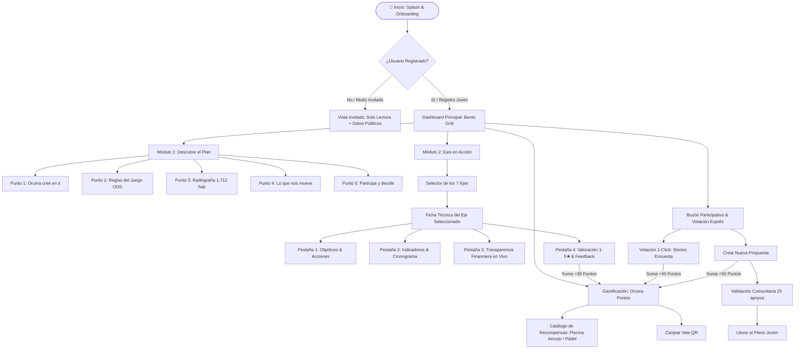

# III PLAN MUNICIPAL DE JUVENTUD DE ORCERA (2027-2031)
## Especificación de Producto Digital, Arquitectura Técnica y Diseño UI/UX Mobile-First

---

## 1. ENFOQUE VISUAL, TONO Y EXPERIENCIA DE USUARIO (UI/UX JUVENIL)

### 1.1. Filosofía de Diseño: "Bento Rural-Tech"
La aplicación no debe parecer un portal institucional frío ni un tablón de anuncios burocrático. Se concibe como una **Super-App Comunitaria de Bolsillo** inspirada en las mejores interfaces de consumo juvenil (estilo Bento Grid de Apple/Linear, micro-interacciones táctiles, tarjetas elevadas con desenfoque de fondo *glassmorphism* y respuesta háptica simulada).

- **Estructura Bento Grid Modular:** La pantalla principal se organiza en tarjetas asimétricas y dinámicas que priorizan el contenido vivo: presupuesto ejecutado hoy, próximo evento de ocio, reto cívico activo y acceso rápido al Plan.
- **Micro-interacciones Fluidas:** Despliegue de acordeones con aceleración elástica (`cubic-bezier(0.16, 1, 0.3, 1)`), barras de progreso con carga animada en tiempo real y contador numérico ascendente en presupuestos.
- **Accesibilidad Universal (WCAG 2.1 AA):** Ratios de contraste superiores a 4.5:1, tipografía legible a cualquier escala, zonas táctiles (*touch targets*) de al menos 48x48px para facilitar el uso con una sola mano en movimiento.

### 1.2. Paleta Cromática: "Sierra de Segura + Neón Digital"
Inspirada en el paisaje natural de Orcera, sus olivares y pinares de alta montaña, equilibrada con acentos digitales de alta energía:

| Token de Color | Hex / HSL | Uso Principal | Significado Simbólico |
|---|---|---|---|
| **Segura Pine Green** | `#064E3B` / `hsl(163, 85%, 16%)` | Cabeceras, acento institucional noble | Los bosques del Parque Natural de Cazorla, Segura y Las Villas |
| **Olive Leaf Light** | `#10B981` / `hsl(160, 84%, 39%)` | Éxito, presupuestos ejecutados, estado finalizado | El olivar orcereño y la vitalidad joven |
| **Amurjo Aqua** | `#06B6D4` / `hsl(188, 94%, 43%)` | Gamificación, piscina de Amurjo, agua y frescura | La icónica piscina natural de Amurjo |
| **Cyber Coral** | `#FF5722` / `hsl(14, 100%, 57%)` | Llamadas a la acción (CTA), alertas, votación exprés | Juventud, rebeldía creativa, urgencia activa |
| **Digital Violet** | `#8B5CF6` / `hsl(258, 90%, 66%)` | Cultura, talento local, innovación digital | Futuro tecnológico rural y conectividad |
| **Dark Segura Slate** | `#0B1319` / `hsl(206, 38%, 7%)` | Fondo principal en Modo Oscuro | El cielo estrellado limpio de la Sierra |
| **Card Surface (Glass)**| `rgba(18, 30, 42, 0.75)` | Tarjetas Bento con `backdrop-filter: blur(16px)` | Sofisticación tecnológica |

### 1.3. Tono y Voz: "De Tú a Tú, Directo y Transparente"
- **Regla de oro:** Cero tecnicismos administrativos. Si un documento oficial dice *"Implementación de medidas transversales proactivas para el fomento de la empleabilidad juvenil en entornos rurales desfavorecidos"*, la app lo traduce a: **"Te ayudamos a encontrar trabajo o montar tu proyecto en Orcera para que no tengas que irte si no quieres"**.
- **Empatía Rural Positiva:** Desmitificar que en los pueblos no pasa nada. Destacar la calidad de vida, la comunidad, el coste accesible y las nuevas oportunidades digitales.
- **Rigor Transparente:** La cercanía no oculta los datos: cada euro presupuestado y cada factura justificada se muestran con claridad contable en un solo toque.

### 1.4. Sistema de Gamificación: "Orcera Puntos & Recompensas Amurjo"
Para garantizar que la juventud no descargue la app y la borre a la semana, se integra una economía de participación cívica:
1. **Acciones que suman Puntos Cívicos:**
   - Valorar una actividad o taller: **+30 puntos**.
   - Proponer una idea en el buzón participativo: **+50 puntos**.
   - Votar en una consulta de presupuestos participativos: **+40 puntos**.
   - Asistir y hacer check-in QR en un voluntariado verde o curso digital: **+100 puntos**.
2. **Niveles Cívicos:**
   - Nivel 1: *Explorador de la Sierra* (0 - 150 pts).
   - Nivel 2: *Activista de Orcera* (151 - 400 pts).
   - Nivel 3: *Motor de la Comarca* (401 - 800 pts).
   - Nivel 4: *Leyenda de Segura* (+800 pts).
3. **Catálogo de Recompensas Reales:**
   - **Pase diario a la Piscina Municipal de Amurjo** (200 pts).
   - **Abono de 1 mes al Gimnasio Municipal / Pistas de Pádel** (450 pts).
   - **Plaza preferente en cursos certificados de Drones, Robótica o DJ** (300 pts).
   - **Merchandising sostenible Orcera Joven** (sudadera orgánica / mochila térmica).

---

## 2. MÓDULO 1: "DESCUBRE EL PLAN" (ACORDEÓN INTERACTIVO DIGERIBLE)

Sintetiza la documentación estratégica de más de 80 páginas en 5 cápsulas interactivas ilustradas y con datos directos:

### Punto 1: Orcera cree en ti (Presentación y Resumen)
- **Lema:** *"Construir tu futuro sin tener que renunciar a tus raíces"*.
- **Contenido digerido:** Este Plan Municipal 2027-2031 es la hoja de ruta diseñada con y para jóvenes de 12 a 30 años. Orcera no es solo el lugar donde creciste; es el lugar donde puedes emprender, tener vivienda asequible, desconectar en plena naturaleza y disfrutar de ocio de calidad. Invertimos más de 72.500 € en 5 años en políticas directas para darte herramientas reales.

### Punto 2: Las reglas del juego (Marco y Normativa)
- **Lema:** *"Un pueblo conectado con el mundo"*.
- **Contenido digerido:** No estamos solos ni improvisamos. El plan está alineado con la **Estrategia Europea de Juventud 2027**, los programas **Erasmus+** para que puedas viajar o hacer voluntariado en Europa, el **Plan Integral de Juventud de Andalucía**, y los **Objetivos de Desarrollo Sostenible (ODS 2030)** de la ONU: trabajo decente, reducción de desigualdades y acción por el clima.

### Punto 3: Radiografía de Orcera (Diagnóstico y Realidad Rural)
- **Lema:** *"Los datos reales sobre nuestra mesa"*.
- **Métricas interactivas visibles:**
  - **Población:** 1.712 habitantes (censo oficial).
  - **Jóvenes censados (12 a 30 años):** ~285 jóvenes (16.6% del total).
  - **Economía:** Alta dependencia del monocultivo del olivar y la campaña de recolección de aceituna.
  - **Oportunidades:** El auge del teletrabajo gracias a la fibra óptica municipal, turismo sostenible en el Parque Natural y la joya de Amurjo.
  - **El Reto:** Frenar la emigración por estudios y falta de alquiler accesible.

### Punto 4: Lo que nos mueve (Principios Rectores)
- **Lema:** *"Nuestros valores no se negocian"*.
- **5 Pilares:**
  1. *Igualdad y Diversidad Real:* Cero tolerancia a agresiones machistas o lgtbifóbicas.
  2. *Salud Mental Sin Estigmas:* Espacios seguros y apoyo psicológico juvenil preventivo.
  3. *Sostenibilidad Activa:* Guardianes del Parque Natural de Segura.
  4. *Innovación Digital Rural:* Conexión y formación tecnológica avanzada desde el pueblo.
  5. *Protagonismo Joven:* Las decisiones no se toman en los despachos; se toman contigo.

### Punto 5: Participa y decide (Metodología Activa)
- **Lema:** *"Tu opinión cambia las partidas del Ayuntamiento"*.
- **Cómo funciona:**
  - **Votaciones Exprés:** Cada mes se lanzan 2 consultas vinculantes de 1 toque.
  - **Buzón Permanente:** Si tu propuesta consigue 25 apoyos, pasa a Pleno Municipal Juvenil.
  - **Evaluación en Vivo:** Tras cada concierto o taller, evalúas con 1 a 5 estrellas. Si una actividad baja de 3 estrellas, se rediseña o se cancela.

---

## 3. MÓDULO 2: "EJES EN ACCIÓN" (ESPECIFICACIÓN DE LOS 7 EJES)

Cada Eje cuenta con una ficha técnica viva con los 7 campos interactivos estandarizados:

```
┌─────────────────────────────────────────────────────────────┐
│ EJE N: [ICONO] TÍTULO DEL EJE TEMÁTICO                     │
├─────────────────────────────────────────────────────────────┤
│ 1. Identificación: Título, Color, Icono, Presupuesto Anual  │
│ 2. Objetivos: General + Específicos desplegables           │
│ 3. Acciones Detalladas: Concejalias, recursos y plazos     │
│ 4. Indicadores de Éxito: Cuantitativos y cualitativos       │
│ 5. Cronograma: Quinquenal 2027-2031 + Trimestral anual     │
│ 6. Panel de Transparencia: Previsto vs Real + % Ejecución   │
│ 7. Espacio Participativo: Rating 1-5 ★ + Comentarios       │
└─────────────────────────────────────────────────────────────┘
```

### Detalle de los 7 Ejes Oficiales

#### EJE 1: Entorno Sostenible, Digital y Conectado
- **Icono:** `leaf-wifi` / Verde Pinar & Cyan (`#10B981` / `#06B6D4`).
- **Presupuesto Anual:** 2.500 € (Total 2027-2031: 12.500 €).
- **Objetivo General:** Garantizar la capacitación digital avanzada, el acceso universal a conectividad y la conservación ecológica del entorno rural de Orcera.
- **Acciones Clave:**
  1. *Talleres medioambientales y voluntariado verde en el Parque Natural*. (Concejalías: Juventud y Medio Ambiente).
  2. *Rutas patrimoniales guiadas y recuperación de senderos históricos*. (Concejalías: Turismo y Deportes).
  3. *Cursos de ciberseguridad, IA aplicada y uso crítico de RRSS*. (Concejalías: Innovación y Juventud).
  4. *Creación y dinamización del Espacio Digital Joven con telecentro 24/7*. (Concejalía: Nuevas Tecnologías).
- **Indicadores:** 120 participantes únicos/año; 4 batidas de limpieza verde; 90% satisfacción en conectividad.

#### EJE 2: Ocio, Cultura, Deporte y Vida Saludable
- **Icono:** `sparkles-trophy` / Cyber Coral & Violet (`#FF5722` / `#8B5CF6`).
- **Presupuesto Anual:** 4.000 € (Total 2027-2031: 20.000 €).
- **Objetivo General:** Ofrecer una alternativa de ocio sano, creativo y activo durante fines de semana y vacaciones escolares.
- **Acciones Clave:**
  1. *Agenda 'Noches Jóvenes de Orcera' (cine al aire libre, conciertos locales, torneos gamer)*.
  2. *Talleres de fotografía, teatro, producción musical y DJ*.
  3. *Circuito multiaventura en Amurjo y Sierra (escalada, tirolina, kayak)*.
  4. *Convocatoria 'Talento Orcereño': ayudas directas para jóvenes artistas locales*.
- **Indicadores:** 250 jóvenes asistentes en eventos de ocio alternativo; 8 talleres culturales anuales; ratio 50% chicos/chicas.

#### EJE 3: Emancipación, Empleo, Formación y Vivienda
- **Icono:** `briefcase-home` / Ámbar Eléctrico & Esmeralda (`#F59E0B` / `#059669`).
- **Presupuesto Anual:** 2.500 € (Total 2027-2031: 12.500 €).
- **Objetivo General:** Facilitar que la juventud orcereña encuentre trabajo digno o emprenda en el pueblo, accediendo a alquiler accesible.
- **Acciones Clave:**
  1. *Punto de Asesoramiento Laboral: CV de alto impacto, simulacros de entrevista y becas*.
  2. *Feria de Emprendimiento Rural y Ayudas a Nuevos Negocios Locales*.
  3. *Bolsa Municipal de Vivienda de Alquiler Joven e intermediación con propietarios*.
  4. *Lanzadera de conexión entre centros de FP comarcales y empresas del olivar y servicios*.
- **Indicadores:** 45 asesoramientos laborales personalizados/año; 6 proyectos de autoempleo tutorizados; 5 viviendas incorporadas a la bolsa de alquiler.

#### EJE 4: Participación Juvenil, Ciudadanía Activa y Voluntariado
- **Icono:** `chat-bubble-heart` / Magenta Fuego (`#EC4899`).
- **Presupuesto Anual:** 1.500 € (Total 2027-2031: 7.500 €).
- **Objetivo General:** Democratizar la gestión municipal empoderando a la juventud en las decisiones presupuestarias y comunitarias.
- **Acciones Clave:**
  1. *Encuentros 'Pregunta a tu Alcalde/sa y Concejales' (cafés y directos en Twitch/Instagram)*.
  2. *Presupuestos Participativos Jóvenes: 1.000 € decididos por votación directa en esta app*.
  3. *Red de Voluntariado Juvenil de Orcera con acreditación de competencias no formales*.
  4. *Subvenciones a proyectos creados y autogestionados por colectivos de jóvenes*.
- **Indicadores:** Más de 180 votos registrados por año en la app; 2 Plenos Municipales Jóvenes anuales.

#### EJE 5: Salud, Bienestar Emocional e Inclusión Social
- **Icono:** `heart-handshake` / Rosa Calma (`#F43F5E`).
- **Presupuesto Anual:** 2.000 € (Total 2027-2031: 10.000 €).
- **Objetivo General:** Brindar acompañamiento integral en salud mental, autoestima y prevención comunitaria sin prejuicios.
- **Acciones Clave:**
  1. *Consultorio confidencial de bienestar emocional y talleres de gestión de ansiedad*.
  2. *Campañas de prevención de adicciones (apuestas online, sustancias y tecno-dependencia)*.
  3. *Programa de acompañamiento e inclusión a jóvenes en situación de vulnerabilidad o soledad*.
  4. *Talleres de nutrición saludable y prevención de TCA con productos locales*.
- **Indicadores:** 70 jóvenes atendidos o participantes en talleres; 100% confidencialidad garantizada; valoración media > 4.5/5.

#### EJE 6: Igualdad, Diversidad y Convivencia
- **Icono:** `shield-rainbow` / Púrpura Real (`#9333EA`).
- **Presupuesto Anual:** 1.500 € (Total 2027-2031: 7.500 €).
- **Objetivo General:** Consolidar a Orcera como un pueblo libre de violencias machistas, seguro para el colectivo LGTBIQ+ e integrador.
- **Acciones Clave:**
  1. *Talleres de relaciones afectivas sanas, desmitificación del amor romántico y consentimiento*.
  2. *Puntos Violeta y Arcoíris en las Fiestas Patronales y eventos juveniles*.
  3. *Jornadas de visibilización de la diversidad funcional y accesibilidad universal*.
  4. *Servicio de mediación joven de conflictos escolares y comunitarios*.
- **Indicadores:** 0 incidencias de acoso en eventos del plan; 15 mediaciones efectivas; 130 asistentes a jornadas de diversidad.

#### EJE 7: Gobernanza, Innovación y Evaluación de las Políticas
- **Icono:** `chart-pie-check` / Azul Cobalto (`#2563EB`).
- **Presupuesto Anual:** 1.000 € (Total 2027-2031: 5.000 €).
- **Objetivo General:** Asegurar la trazabilidad, transparencia pública en datos abiertos y evaluación continua del impacto del Plan.
- **Acciones Clave:**
  1. *Comisión Técnica Interdepartamental (Juventud, Empleo, Obras, Servicios Sociales)*.
  2. *Mantenimiento y actualización en tiempo real de los datos abiertos en la App del Plan*.
  3. *Informe Anual de Evaluación de Impacto publicado en formato descargable y comprensible*.
  4. *Evaluación Quinquenal Ex-post 2031 y diseño participativo del IV Plan*.
- **Indicadores:** 4 reuniones de la comisión técnica anuales; 100% de los datos presupuestarios actualizados mensualmente; informe anual auditado.

---

## 4. USER FLOW (FLUJO DE NAVEGACIÓN Y ARQUITECTURA DE INFORMACIÓN)



---

## 5. WIREFRAMES Y ESPECIFICACIÓN TEXTUAL DE COMPONENTES UI

### Componente 1: Header Bento & Widget de Progreso Quinquenal
```
+-------------------------------------------------------------+
| [Escudo Orcera] ORCERA JOVEN 2027-2031         [Modo Claro] |
| Hola, Sara! (Nivel 2: Activista de la Sierra)     [★ 240 pts]|
+-------------------------------------------------------------+
| [ WIDGET BENTO: IMPACTO GENERAL DEL PLAN ]                  |
| Presupuesto Quinquenal: 72.500 € | Invertido 2027: 14.500 € |
| Progreso de Ejecución: [██████████░░░░░░░░░░] 38.4%        |
| Acciones Finalizadas: 14 de 35 | Satisfacción Joven: 4.8/5  |
+-------------------------------------------------------------+
```

### Componente 2: Ficha Técnica de Eje en Acción (Mobile Card View)
```
+-------------------------------------------------------------+
| [< Volver a Ejes]              [Eje 2: Ocio, Cultura & Vida]|
| Color: Coral Eléctrico (#FF5722) | Presupuesto Anual: 4.000 €|
+-------------------------------------------------------------+
| TÍTULO: Ocio Alternativo, Cultura, Deporte y Salud          |
| "El finde no termina en el sofá: ocio vivo en la Sierra"    |
+-------------------------------------------------------------+
| [TABS: (1) Acciones | (2) Cronograma | (3) Finanzas | (4) Eval]|
+-------------------------------------------------------------+
| TAB SELECCIONADA: (3) PANEL DE TRANSPARENCIA EN TIEMPO REAL |
|                                                             |
| Presupuesto Previsto 2027: 4.000,00 €                       |
| Gasto Real Justificado:    2.850,00 €                       |
| Nivel de Ejecución:        [██████████████░░░] 71.25%       |
|                                                             |
| Detalle de Gasto Público:                                   |
| - Cine de Verano en Amurjo: 1.200 € (Factura #ORC-27-01)    |
| - Taller de DJ y Beatmaking:  850 € (Factura #ORC-27-04)    |
| - Rocódromo y Multiaventura:  800 € (Factura #ORC-27-09)    |
+-------------------------------------------------------------+
| TAB SELECCIONADA: (4) ¿QUÉ TE PARECE ESTE EJE?              |
| Tu valoración:  [★] [★] [★] [★] [☆] (4.0 / 5)              |
| [ Deja un comentario o propuesta de mejora...             ] |
| [ Botón: Enviar Valoración y Ganar +30 Puntos Orcera       ]|
+-------------------------------------------------------------+
```
